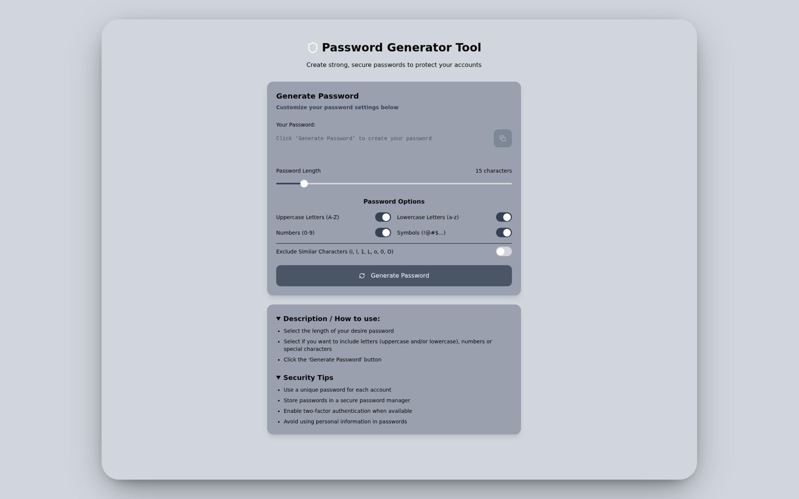
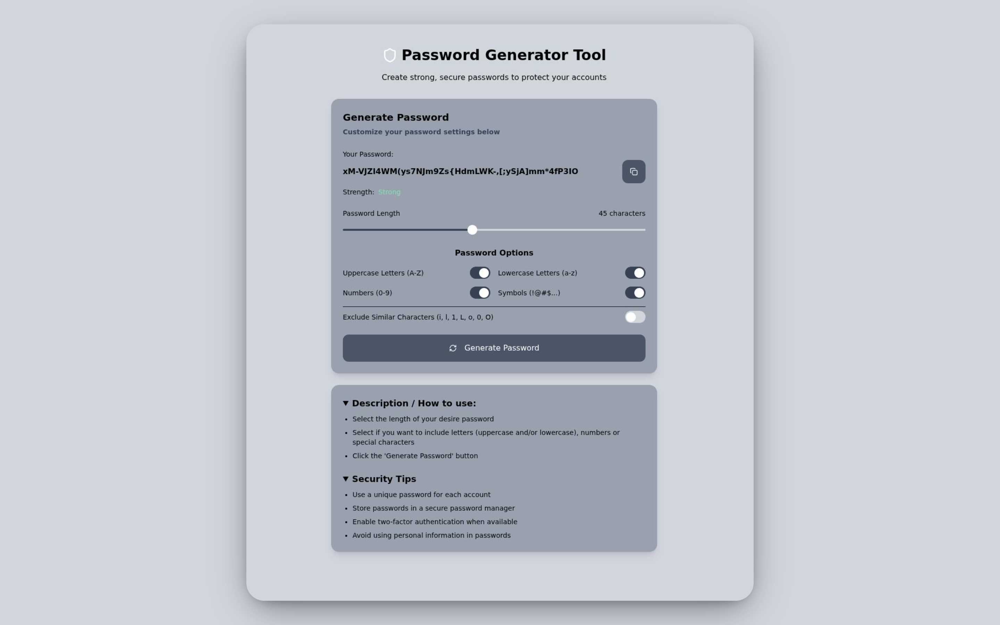
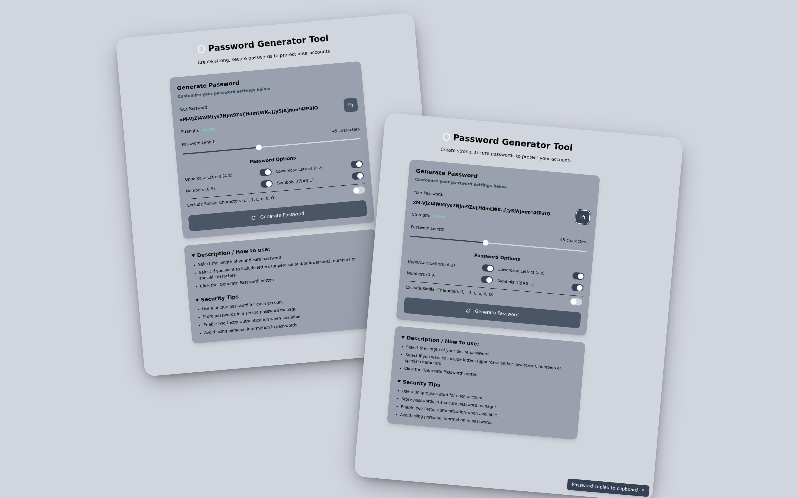

# 🔐 Password Generator Tool

**Live Demo:** [javierdebug.github.io/password-generator-tool](https://password-generator-tool-one.vercel.app/)  

## 📖 About the Project  
This is a **password generator tool** built with **Vite**, **React**, **TypeScript**, and **Tailwind CSS** for a modern development stack and styling approach.  

The application allows users to generate random and secure passwords based on their preferences:  
- ✅ Adjustable password length  
- ✅ Options to include uppercase, lowercase, numbers, and special characters  
- ✅ Options to exclude similar characters (i, l, 1, L, o, 0, O)
  
This tool also includes:
- ✅ Copy-to-clipboard functionality  
- ✅ Fully responsive design  

The original version was and old project of mine [archived repo](https://github.com/javierdebug/Password-generator) built with **vanilla HTML, CSS, and JavaScript**. This new version improves performance, maintainability, and styling flexibility.  

## 🖼️ Preview  

**General View:**  

**Generating a password:**

**Copy to Clipboard functionality:**

## 🛠️ Tech Stack  
- ⚡ **Vite** – Lightning-fast build tool  
- ⚛️ **React** – Component-based UI  
- 🟦 **TypeScript** – Strong typing for reliability  
- 🎨 **Tailwind CSS** – Utility-first styling  

